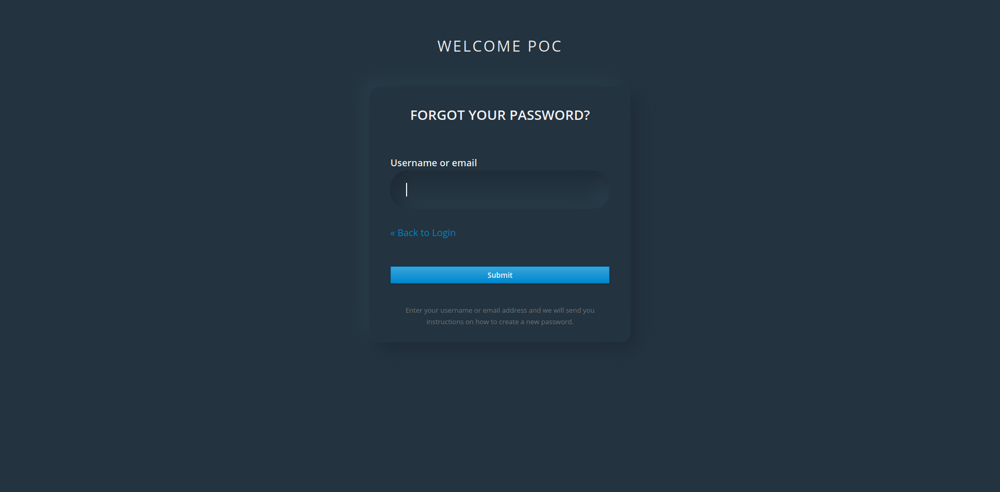

# Description
PoC Keycloak Custom View Themes

## scaffolding project
We are going to create the keycloak theme scaffolded called **poc** from keycloak **base theme**

The folders and files structure must be like this where poc subfolfer it's the custom name for out theme:


```shell
themes
  |
  poc
    |
      login
        |    
          resources
            |
              css
                styles.css
        theme.properties
```

## Create the custom theme
Now we are going to create the base login template from the base login keycloak theme.
Inside project folder execute this docker command:

```shell
docker cp keycloak-11:/opt/jboss/keycloak/themes/base/login/login.ftl ./themes/poc/login/login.ftl

```

## Coding
Now we must coding the login freemaker template from login.ftl file and add new styles for it and add configure the theme properties to be deployed

The final

The folders structure is:

```shell
themes
  |
  poc
    |
      login
        |    
          resources
            |
              css
                styles.css
        theme.properties
        login.ftl    

```

## Deploy keycloak container

```shell
docker-compose up
```

## Configure keycloak with the new theme

Access to master realm

```shell
http://localhost:8080
```

- Create a new realm called poc.
- Set a new HTML Display name like Welcome PoC.
- Activate Forgot password and Remeber Me flags.
- Set the new login theme called poc from the Themes Tab Ralm Settings.


## Access to the new realm login view

```shell
http://localhost:8080/auth/realms/poc/account
```

Login View 


Forgotpassword View 



## Some links 

To check official keycloak Themes go to [Keycloak Themes](https://www.keycloak.org/docs/latest/server_development/#_themes)